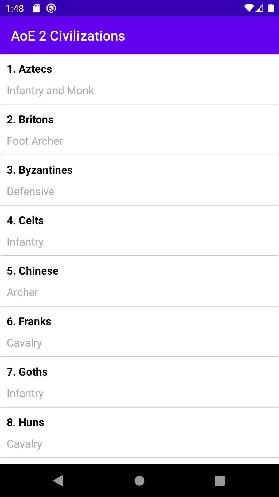

# aoe2metadata
An android app displaying a minimal list of all the available civilizations of Age of Empires 2 (including Age of Kings, The Conquerors, Forgotten Empires, African Kingdoms and Rise of Rajas). Information displayed is minimal, i.e. the name of the civilization along with its army type are available.

The application is available on [Google Play](https://play.google.com/store/apps/details?id=gr.mastro.ageofempires2metadata).

# Screenshots

# Sources
- Inspiration: https://rahul9650ray.medium.com/how-to-implement-rest-api-in-android-using-retrofit-in-kotlin-part-1-1302cb0d978b
- Data: Age Of Empires II API https://age-of-empires-2-api.herokuapp.com/docs/.